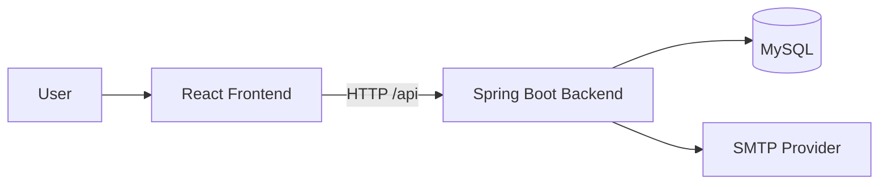
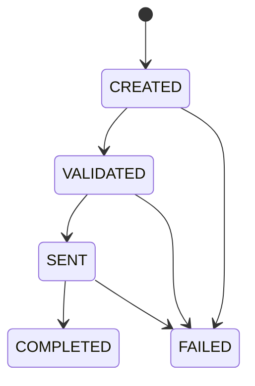

# Architecture

## Overview

The platform is a full-stack payment processing application with:

- Backend API: Spring Boot + JPA
- Frontend UI: React + Vite
- Database: MySQL
- Container orchestration: Docker Compose
- Deployment runner: Jenkins

## High-Level Component Flow

## Backend Layering

- Controller layer: HTTP request/response handling.
- Service layer: payment flow orchestration and business actions.
- Validation layer: business rule checks (amount, currency, accounts, status transitions).
- Repository layer: persistence through Spring Data JPA.
- Exception layer: centralized error mapping to consistent JSON payloads.

## Core Payment Lifecycle

Operational meaning:

- CREATED: Payment request accepted and stored.
- VALIDATED: Business validations passed.
- SENT: OTP verified and transfer execution started.
- COMPLETED: Transfer finished and recorded.
- FAILED: Terminal failure from any prior state.

## OTP Flow

1. Client calls POST /api/payments/{id}/send-otp after validation.
2. Backend generates a 6-digit OTP and sends it to configured recipient email.
3. Client submits OTP to POST /api/payments/{id}/process.
4. Backend verifies OTP, updates status, and performs transfer.

## Data Model Summary

- account: Account identifier and available balance.
- payment: Payment request, transfer metadata, and current status.
- payment_history: Audit trail of status transitions and remarks.

## Concurrency and Consistency Approach

- Transfer logic locks both source and destination accounts.
- Lock order is deterministic to reduce deadlock risk for opposite transfers.
- Payment history captures each status transition to support auditability.
